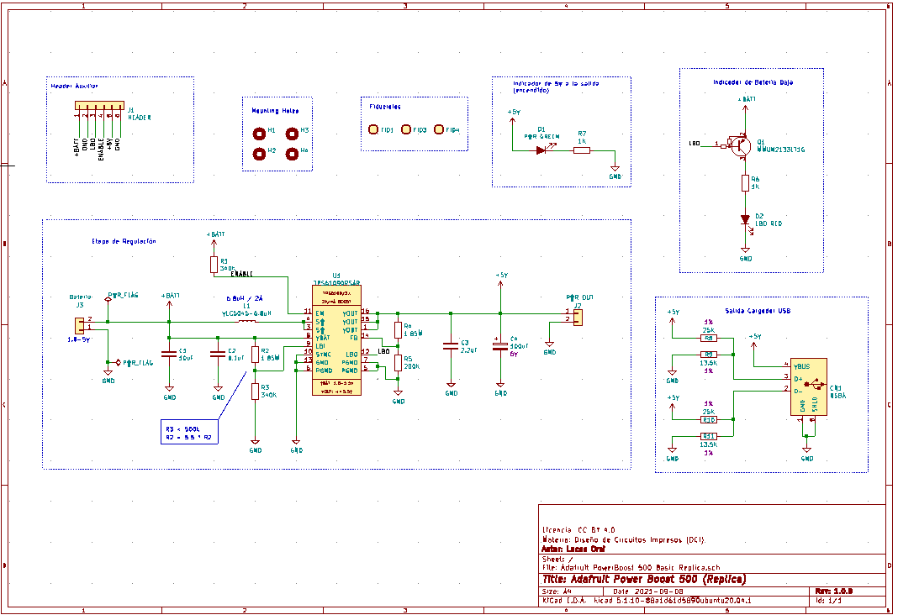
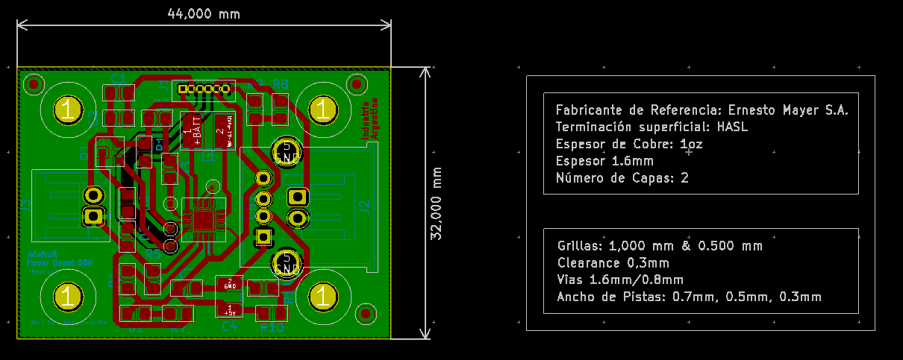
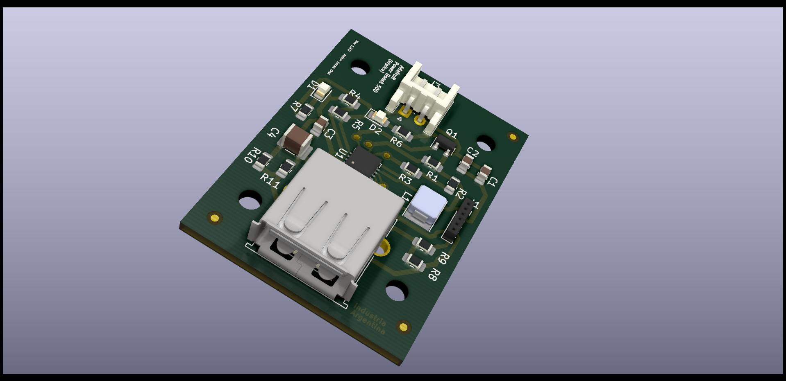
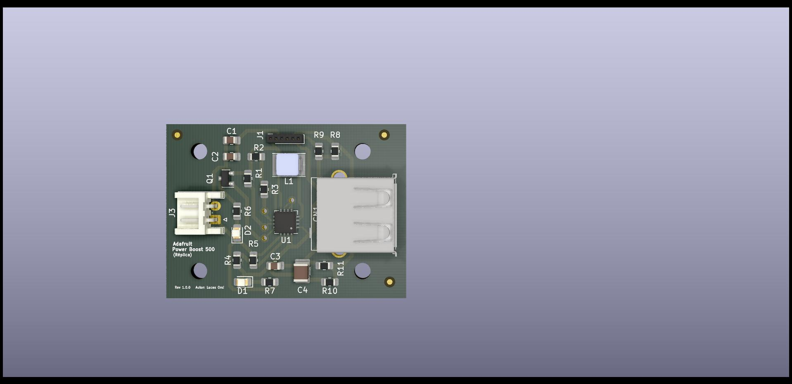
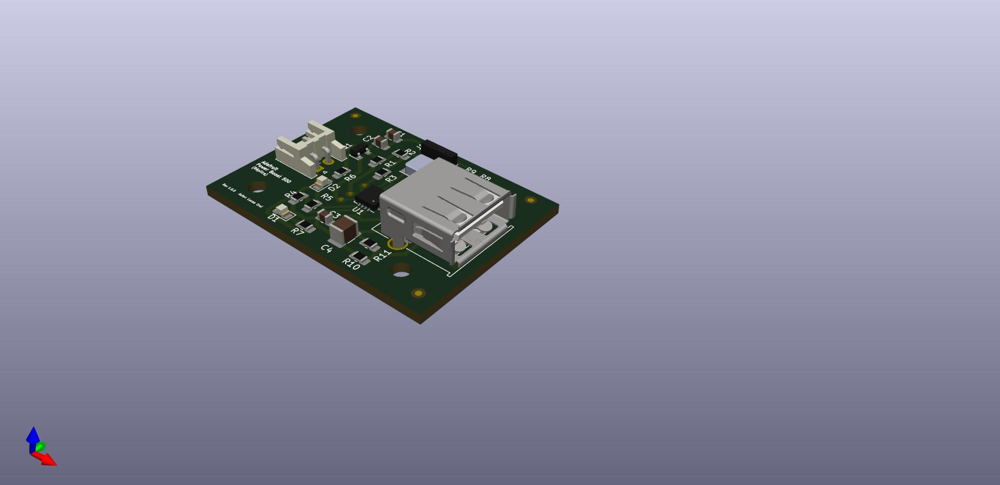

## Trabajo práctico final de la asignatura DCI ##
Este repositorio contiene el trabajo práctico final para la asignatura de Diseño de Circuitos Impresos de la carrera de posgrado de FIUBA.

* Autor: Lucas Orsi
* Título corto del trabajo:  Adafruit Power Boost 500
* Descripción: Módulo convertidor elevador de DC-DC que puede funcionar con baterías de 1.8V o más, y convertir ese voltaje a 5.2V DC para proyectos de 5V.

## Resultados Obtenidos

## Estructura del TP FINAL ##

* doc: Toda la información sobre el circuito, principalmente de autoría o procesamiento propio. Por ejemplo:
  * Notas de ingeniería propias.
  * Notas de aplicación propias.
  * Estudios previos, estado del arte, resumen de las investigaciones.
  * Notas con cálculos.
  * Dibujos adicionales.
  * Fotos de los prototipos.
  * Presupuestos, cotizaciones.
* info: Toda la iformación recolectada, principalmente de terceros, como por ejemplo:
  * Hojas de datos.
  * Notas de aplicación.
  * Info de productos comerciales.
  * Info en internet.
* pcb: Archivos de diseño esquemático y pcb.

## Licencia de este trabajo ##
Creative Commons Attribution-ShareAlike 4.0 International
